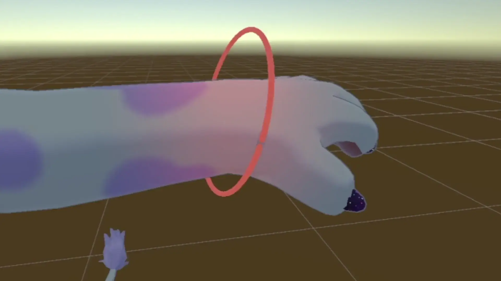

import { LinkCard } from "@astrojs/starlight/components";

<LinkCard title="View on GitHub" href="https://github.com/cuebitt/ReflectionEmissionBaker" />

## Description

Reflection Emission Baker is a Unity editor tool used to "bake" realtime light reflections to an emission mask. You can use it to add AudioLink-reactive avatar props that shine light onto your avatar's body. This way, your reflection effect won't be blocked by performance gating!

There are _no realtime lights_ in this preview!

## Usage

Reflection Emission Baker is a Unity editor tool. For information on how to use it, see [cuebitt/ReflectionEmissionBaker](https://github.com/cuebitt/ReflectionEmissionBaker).
